# Ames Housing: Real-Estate Valuation & Investment Risk

An automated valuation model (AVM) for residential property in Ames, Iowa, tested on
later sales it had not seen, with a measured range around every value. It is followed
through to monitoring, loan losses, rental underwriting and a one-page client report.

[](https://github.com/myesmin/real-estate-valuation-risk/actions/workflows/tests.yml)
[](https://huggingface.co/spaces/myesmin1103/ames-avm)
[](pyproject.toml)

**[Read the results as a single page](https://huggingface.co/spaces/myesmin1103/ames-avm)**:
headline numbers, figures and three sample valuation reports, built from this pipeline's
own outputs.

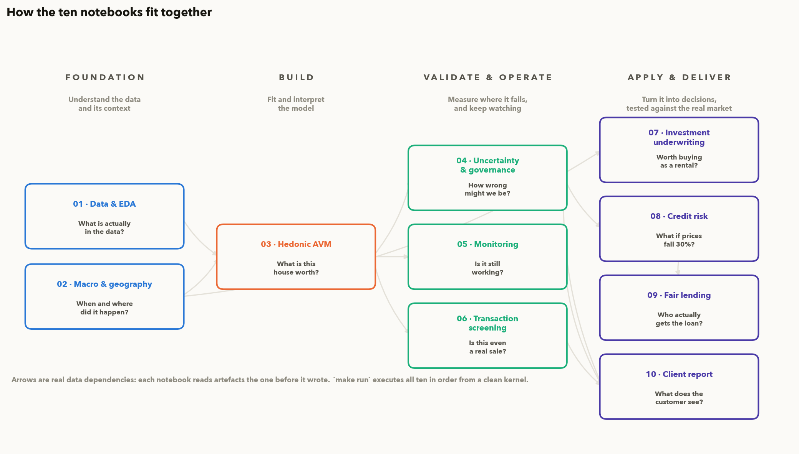

---

## Overview

An AVM is the kind of model a lender uses to estimate collateral value when writing a
mortgage, and the kind behind the price estimate on a listing site. This repository
builds one and then does what a lender would have to do with it: validate it forward in
time, review it against the 2024 interagency AVM rule, monitor it, price its errors into
credit risk, and turn it into something a client can read.

It started as a rebuild. An earlier pass on this dataset (three notebooks, one
regularised regression, one reported accuracy figure) had ten defects, and four of them
invalidated every reported result. The worst wrote training rows into the held-out test
frame through index alignment, so the test metrics described data the model had already
seen. Nothing raised an error, and because the held-out prices had been withheld,
nothing could be checked.

De Cock (2011) publishes those prices. Scored against them, the first pass comes out at
**MdAPE 36.9% and R² −0.90**, worse than predicting the average price for every house.
The rebuilt pipeline scores **MdAPE 5.1%** on the same 878 homes, with 78% lower RMSE.
Each defect and its fix is in the [Model Risk Log](docs/MODEL_RISK_LOG.md).

The work is organised as seven questions, one per notebook, roughly in the order a
lender, investor or customer would ask them:

1. **How accurate is it, and how sure can you be?** Every valuation comes with an 80%
   conformal range, and the share of sales that actually land in their range is measured.
2. **Is it still working?** Drift and accuracy control charts over six quarters. Run on
   the real non-market sales as a test, five of the six controls fire.
3. **Which sales can be trusted?** Foreclosures and family transfers don't sell at market
   value. A classifier flags them before they reach the training data.
4. **Does it work as a rental investment?** Across the valuation universe the median cap
   rate is 2.03%, against a 4–8% band set before the analysis. Property tax at the Story
   County levy and insurance take about 40% of gross rent before any debt service.
5. **What happens to loan losses under stress?** A 30% price fall (the Federal Reserve's
   severely adverse scenario) takes expected loss on the constructed book from 0.88% to
   11.8%, and pricing in valuation uncertainty adds another 0.75%.
6. **Who gets credit?** The loan book above is constructed, so it says nothing about
   access to credit. 32,926 HMDA applications from the same metro area do: Black
   applicants were denied at about **twice** the rate of white applicants, and income,
   loan size and loan-to-value don't explain the gap.
7. **What does the client see?** A one-page report with the estimate, its range and the
   model's known weaknesses, produced on demand by the service (`make serve`) and shown on
   the [results page](https://huggingface.co/spaces/myesmin1103/ames-avm).

**Main finding.** A mortgage is written against a valuation, not a sale price, so any
error in the valuation becomes an error in the loan-to-value ratio. Every loan in the
constructed book is written at 80% LTV on the model's value; measured against what the
houses sold for, none of them is at 80%. Valuing the collateral at the low end of the
model's range instead of its point estimate adds **85%** to expected credit loss. That
link is the reason regulators set quality-control standards for AVMs.

One pre-registered check failed. The rental analysis was given a plausible cap-rate band
of 4–8% before it was run, and the median came out at 2%. It is reported as it came out,
and notebook 07 traces it to property tax and insurance.

> New to the terms? [`docs/GLOSSARY.md`](docs/GLOSSARY.md) explains every one of them
> from scratch.

---

## Approach

Beyond fixing the baseline, the project adds what the first pass didn't have: validation
forward in time, a conformal range for every property, a governance review against the
June 2024 Interagency AVM Rule, an **SR 11-7** style validation report with ongoing
monitoring, a rental underwriting model, a credit-risk model that prices valuation
uncertainty in basis points, a classifier for non-market sales, and a client report.

> Every number below comes out of `make all` on a clean clone. Every input is a named
> public source, and every assumption is listed in [`docs/ASSUMPTIONS.md`](docs/ASSUMPTIONS.md).

---

## Headline results

### What the defects cost, on the same 878 held-out homes

| | First pass | Current pipeline | |
|---|---:|---:|---|
| **MdAPE** | 36.9% | **5.1%** | |
| **PPE10** (within ±10%) | 13.9% | **76.9%** | |
| **RMSE** | $112,154 | **$24,996** | −78% |
| **R²** | −0.90 | **0.91** | |

An R² of −0.90 means the first pass was worse than predicting the training mean for every
house. From inside its notebook it looked fine: the code ran and the histogram of predicted
prices looked plausible. There were no test labels to check it against.

### AVM accuracy, both evaluation regimes

The valuation universe is 2,412 arm's-length sales. Models: Ridge / Lasso / ElasticNet /
LightGBM, all in `sklearn` pipelines, tuned with `GroupKFold` on `Neighborhood`.

| Model | MdAPE random | MdAPE temporal | PPE10 random | PPE10 temporal | RMSE random | RMSE temporal |
|---|---:|---:|---:|---:|---:|---:|
| Ridge | 5.57% | 5.82% | 77.0% | 75.6% | $18,093 | $16,579 |
| Lasso | 5.43% | 5.71% | 77.1% | 76.9% | $18,134 | $16,635 |
| ElasticNet | 5.38% | 5.71% | 77.0% | 76.3% | $18,151 | $16,661 |
| **LightGBM** | **5.15%** | **5.49%** | 76.8% | 76.6% | $15,869 | $17,551 |

*Random* = 75/25 shuffled, comparable to the first-pass design.
*Temporal* = train 2006–2008, test 2009–July 2010.

Against the usual institutional AVM thresholds, PPE10 above 75% passes and MdAPE below 5%
fails, by about half a point. Both are the temporal-regime figures.

The gap between the two regimes is small, 4–7% in relative terms, and that says more about
Ames than about the model. Ames fell 4.3% peak to trough while the nation fell 27.4%; with
Iowa State as the main employer, the local market barely has a cycle. The measured
degradation is a lower bound, and the same test in a cyclical market would show much more.

---

## The analysis

### 1 · Macro & geospatial ([`02_macro_and_geospatial.ipynb`](notebooks/02_macro_and_geospatial.ipynb))

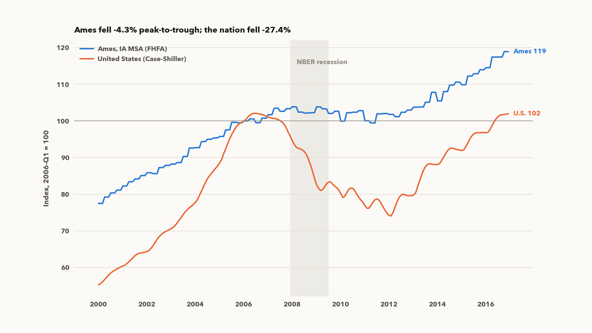

Ames largely sat out the bubble and the bust, but it wasn't flat in real terms. By 2012
the nominal index was back at 101.8 while the CPI-deflated index was at 89.0, an 11% loss
of purchasing power over six years.

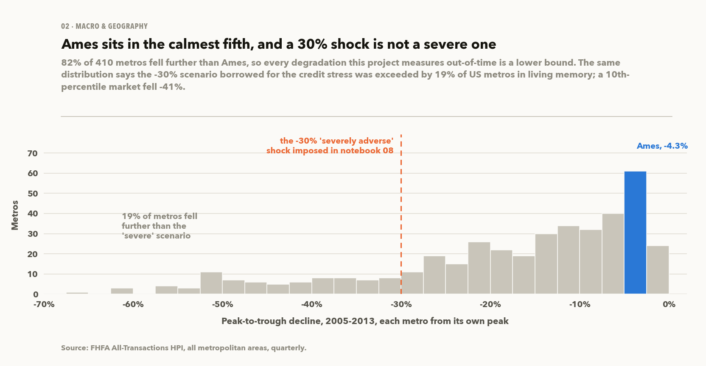

The national figure is an average of Merced at −65% and Ithaca at −4%, among others. FHFA
publishes every metro, so Ames can be ranked instead: **82% of 410 metros fell further**,
each measured from its own peak. That is the basis for every "lower bound" in this
project, and the same distribution shows the −30% credit stress is not especially severe.

Affordability compares the monthly payment at the PMMS rate of the day with Story County
income. The 2006–2010 window is the easy part of that chart; the burden peaked much later,
driven by rates rather than Ames prices. At a constant payment, each 100 bp on the rate
moves what a buyer can pay by 9.4%, which is why notebook 07 draws rates and cap rates
together.

On its own, distance to the ISU campus adds a highly significant **10.4% per mile** to
price per square foot. Once house age, quality, lot size and sale year are controlled for,
it is −0.04% per mile (t = −0.06). The campus gradient is entirely a housing-age effect,
and a hand-built location score would have priced in a premium that isn't there.

### 2 · Hedonic model → AVM ([`03_hedonic_avm.ipynb`](notebooks/03_hedonic_avm.ipynb))

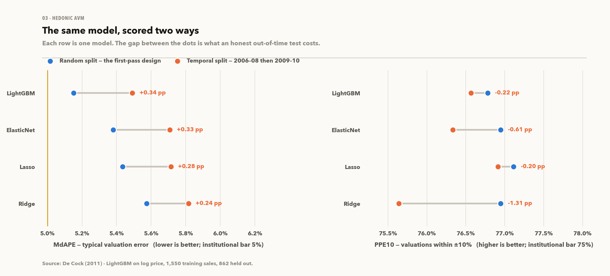

The target is `log(SalePrice)`, converted back to dollars with Duan smearing. Simply
exponentiating a log prediction gives the conditional median, which values every house
slightly low. The correction barely moves MdAPE (itself a median) but fixes the mean signed
error, and that is the part that becomes LTV error later.

The ten quality scales are encoded as ordered numbers instead of one-hot columns, which
drops about 40 columns and keeps the ordering. The coefficients come out in units a valuer
can check: on the median $158,750 home, **one grade of Overall Quality is worth about
$9,600**, roughly 360 sq ft of living area at the model's implied $27 per sq ft.

Grouped by sale price, errors slope from over-valuation at the cheap end to
under-valuation at the top. Most of that slope is produced by grouping on the quantity
being estimated rather than by the model; notebook 04 separates the two (see below).

#### The SQL feature layer, and a negative result

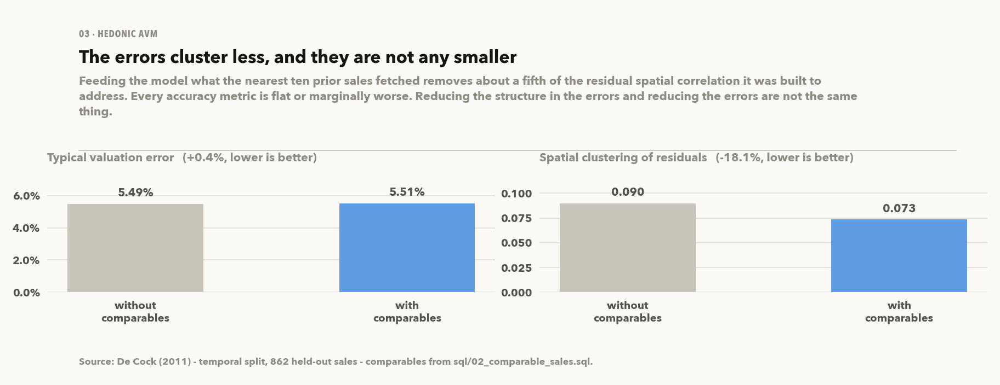

Residuals that cluster in space suggest the model doesn't know what nearby houses cost.
Commercial AVMs handle that with comparable sales, which is a SQL job: a self-join on the
sales table with a distance condition, a strict time cutoff, and a window function to keep
the nearest ten. It runs in DuckDB over the same parquet files
([`sql/02_comparable_sales.sql`](sql/02_comparable_sales.sql)).

Two conditions in the query keep it from leaking:

- **`c.sale_time < s.sale_time`**: a comparable must already have sold.
- **`c.is_training`**: its price must come from a training row. The time cutoff isn't
  enough on its own, because under a shuffled split an earlier sale can be in the test set,
  and its price would then leak into another test row's features.

`tests/test_warehouse.py` checks both, and checks that the tests can fail: move the future
sale earlier and its $600 per sq ft does come through.

The feature worked as intended and didn't improve accuracy. Moran's I fell 18%, from
0.0897 to 0.0734, while MdAPE went from 5.49% to 5.51%, PPE10 fell 0.8 points and RMSE rose
1.1%. Moran's I measures whether errors are organised in space, not whether they are
small. The comparable prices do carry location information (correlation 0.64 with the
home's own price per sq ft), but the model had already picked it up from `Neighborhood`
and the distance features. The errors moved around without getting smaller.

So the original diagnosis was wrong: four fifths of the clustering survives the obvious
fix, and the open question is now what else location carries.

**A Ridge / LightGBM blend was measured and not promoted.** The two models make different
errors out of time (LightGBM wins the median, Ridge the tail), so an average should beat
both. With the weight chosen on training folds only (65% Ridge), the temporal holdout gives
MdAPE **5.38%**, PPE10 **78.4%** and RMSE **$15,844**, against LightGBM's 5.49%, 76.6% and
$17,551. PPE10 improves in both regimes and out-of-time RMSE falls 10%, but the MdAPE gain
sits inside a paired-bootstrap 95% interval that spans zero, and the 5% bar is not
cleared. Promoting it would mean recalibrating every downstream interval and credit figure
for a headline gain the evaluation cannot distinguish from noise, so LightGBM stays. A
50/50 blend scores 5.22% on the same test set, but was not chosen: picking it because it
scored best there would be tuning on the test set.

### 3 · Uncertainty & governance ([`04_uncertainty_and_governance.ipynb`](notebooks/04_uncertainty_and_governance.ipynb))

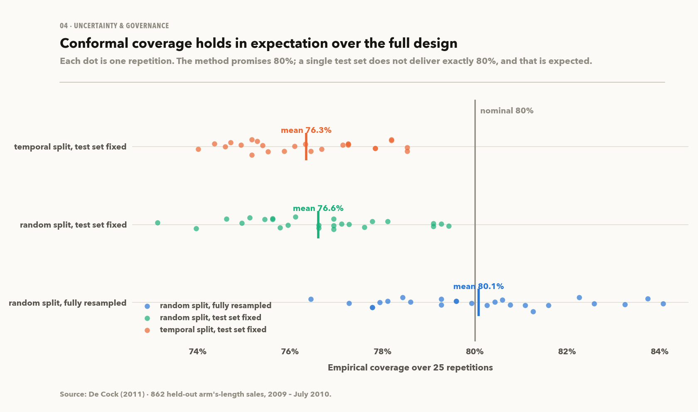

Every property gets an 80% valuation range from split-conformal prediction, which doesn't
assume the Gaussian, equal-variance residuals this data clearly doesn't have. The range is
proportional to the value, so expensive collateral gets a wider dollar band. The served
version sets the width separately for five price bands and re-fits it each quarter on the
last twelve months of closed sales. As served (calibrated on October 2009 to July 2010),
the range is **30% of value below $122k, 21–26% in the middle and 23% above $216k**,
averaging 25%.

Coverage is measured, not assumed. Resampling the full random design gives **80.1%**,
exactly the guarantee, but a single 603-row holdout has a 1.6-point binomial standard error
before any variance from estimating the interval, so one holdout can't validate it. Under
the temporal split coverage settles near 77%, because 2009–10 sales don't behave like the
2006–08 sales the range was calibrated on. **Re-fitting the range each quarter lifts it to
78.8%** in a strict backtest, where every 2009–10 sale is scored with the range it would
have been given at the time. The cost is 1.2 points of width, and the paired 95% interval
for the gain is +0.8 to +3.4 points (notebook 05).

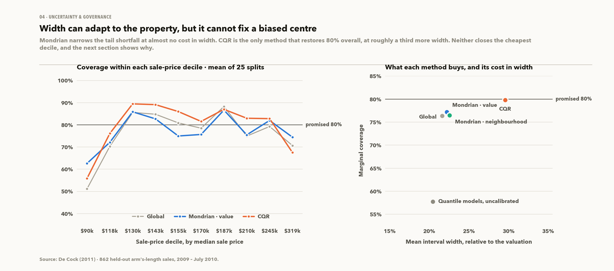

A single width fails by segment. Giving every property the same ±21% covers the cheapest
sale-price decile only 51% of the time. Two alternatives were tested over 25 calibration
splits:

| Interval | Coverage | Mean width | Cheapest decile | Top decile |
|---|---:|---:|---:|---:|
| Global split conformal | 76.3% | 21.6% | 51.2% | 70.7% |
| **Mondrian, by valuation quintile** | 77.2% | 22.2% | **62.6%** | **74.5%** |
| Conformalized quantile regression | **79.8%** | 29.6% | 55.9% | 67.6% |
| Quantile models, uncalibrated | 57.7% | 20.4% | 43.7% | 49.3% |

Mondrian conformal, grouped by the valuation, lifts the cheapest decile by 11 points for
0.6 points of width. (Grouping by sale price isn't possible, since that's what is being
estimated.) It is the interval the service, the model card, the client report and the
credit analysis use. CQR is the only method that gets back to 80% overall, at 37% more
width. The same quantile models without the conformal step cover 57.7%, which shows how
much the calibration step does.

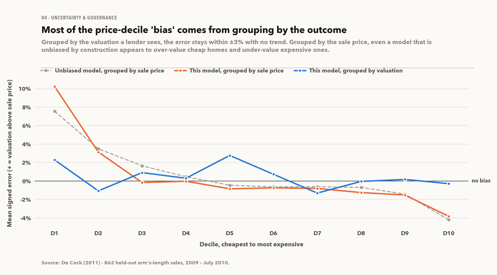

None of the widths fixes the cheapest decile, and working out why corrected an earlier
finding. Grouped by sale price, the model seems to over-value the cheapest decile by 10.2%
and under-value the top by 3.8%. But a sale lands in the cheapest decile partly because
its price came in below its valuation, so grouping on the outcome selects on the error. A
model that is unbiased by construction, with the same error spread, shows +7.6% and −4.2%
under that grouping. Grouped by valuation, the mean error stays within ±2.8% in all ten
deciles. **The real over-valuation at the cheap end is about 2–3%, and there is none at the
top.** A client-report flag built on the 10% figure was withdrawn and logged as Model Risk
Log defect #11.

Governance is mapped factor by factor to the June 2024 Interagency AVM Quality Control
Rule (OCC, Fed, FDIC, NCUA, CFPB, FHFA), including its fifth factor, nondiscrimination.
Here that means error-parity tests across neighbourhoods (a 10.1-point spread in bias) and
valuation bands. The Ames data has no protected-class attribute, so this is not a
fair-lending test; it only checks whether error varies by place and price.

Moran's I on the residuals is 0.114 (p < 1e-12): valuation errors cluster in space, so
`Neighborhood` hasn't captured location. Notebook 03 §9 tries the obvious fix.

### 4 · Ongoing monitoring ([`05_model_monitoring.ipynb`](notebooks/05_model_monitoring.ipynb))

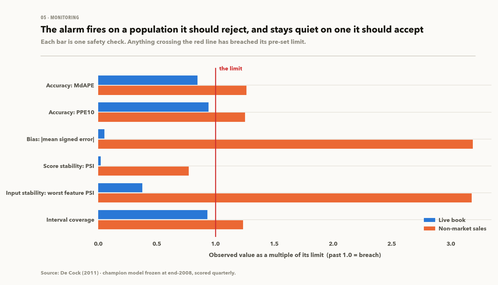

SR 11-7 splits validation into conceptual soundness, outcomes analysis and ongoing
monitoring. This notebook is the third.

The champion model is frozen at launch and watched over six production quarters with six
controls whose limits were set in code before any output existed. All six stay inside
their limits.

To check that the controls can fire at all, they are run on the 517 non-market sales,
which they should reject. Five of the six fire. Score stability doesn't, because
non-market homes look like market homes; only the price they sell at differs. That blind
spot is why the pack monitors inputs, scores and outcomes together.

Two problems with the monitoring metric itself came up while building it and are handled
in code. `sale_time` scores a PSI of 11.3 every period, because the temporal split
guarantees it, so it is excluded. And PSI depends on sample size: with ten bins and eight
observations it reported 7.55 from noise alone. Both cases now return "not measurable".

A challenger retrained every quarter won 50% of periods against a 60% promotion bar set in
advance, so it was not promoted. Re-fitting the interval each quarter did help, and is now
how the served range is maintained (§3 above).

### 5 · Transaction screening ([`06_transaction_screening.ipynb`](notebooks/06_transaction_screening.ipynb))

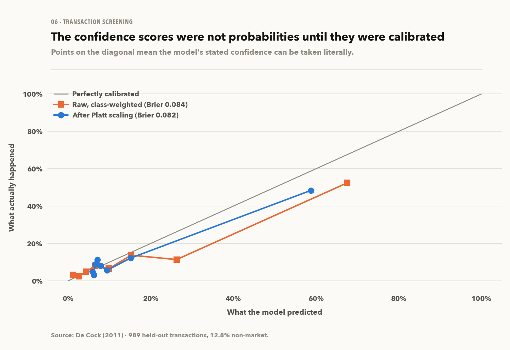

Notebook 03 drops non-market sales using an assessor field, which in a live feed is often
late, blank or wrong. This notebook asks whether a sale can be flagged from its own
attributes instead.

It is an imbalanced problem (17.6% positive), so accuracy is misleading: a model that
always says "market sale" is 82.4% accurate. **PR-AUC is 0.577 against a no-skill baseline
of 0.128 (4.5x), and top-decile lift is 4.7.** At the chosen threshold it cuts
contamination from 12.8% to 6.8% without any assessor labels.

Three design decisions:

- **Two models.** Comparing the agreed price with the AVM's estimate is a strong signal, but
  it only exists after a sale. So there is a pre-transaction model (attributes only) and a
  post-transaction model, and each is quoted only for the use it supports.
- **Cross-fitting.** Feeding one model's output into another leaks: on rows the AVM was
  trained on, its residual is close to zero. Before cross-fitting, training-row price gaps
  were 2.6x smaller than test-row ones.
- **Calibration.** `class_weight="balanced"` ranked well but gave overconfident
  probabilities, which breaks a cost-based threshold. Platt scaling fixed it and left
  ROC-AUC, PR-AUC and KS unchanged to four decimal places, as a monotone transform must.
  Isotonic calibrated slightly better but cost 6 points of PR-AUC, a bad trade with about
  485 calibration rows.

### 6 · Investment underwriting ([`07_investment_underwriting.ipynb`](notebooks/07_investment_underwriting.ipynb))

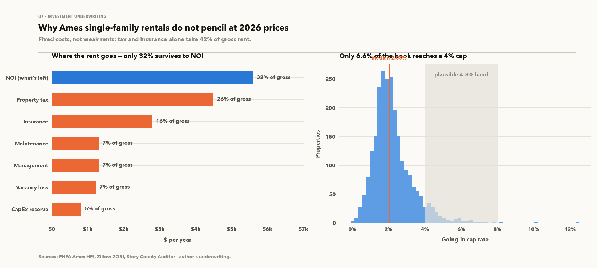

Each sale is rolled forward to 2026 on the FHFA Ames index (median $310k) and checked
against Zillow ZHVI ($280k). The 11% gap between them is carried as a stated uncertainty.
Rents come from ZORI, scaled by size and bedrooms.

The cap-rate band of 4–8% was set before the analysis, and the result falls well below it.
The median going-in cap rate is **2.03%**, only 6.6% of the book reaches 4%, median DSCR is
0.33, and 0.7% of properties have positive cash flow. The inputs were left as they were and
the cause was traced instead.

The cause is fixed costs: **property tax and insurance take about 40% of effective gross
income** before any other expense. Iowa's effective residential tax rate (1.4505% of market
value, cited in full) scales with value, and Ames values have roughly doubled since 2010
while rents haven't.

The screen still gives a usable number: the median property clears a 1.25x DSCR at
**$110,491, 64% below** its 2026 value.

In the sensitivity analysis, house-price growth matters three times as much as the next
driver, and the exit cap rate has no effect at all because the income-based exit never
binds. Ames homes are priced by owner-occupiers, not investors. Monte Carlo over 4,000
correlated draws gives a 54% chance of a negative IRR and a 100% chance of DSCR below 1.0.
Where there is a return, it comes from appreciation and paying down the loan, so this is
really a leveraged bet on house prices with some rent attached.

### 7 · Credit risk & portfolio ([`08_credit_risk_and_portfolio.ipynb`](notebooks/08_credit_risk_and_portfolio.ipynb))

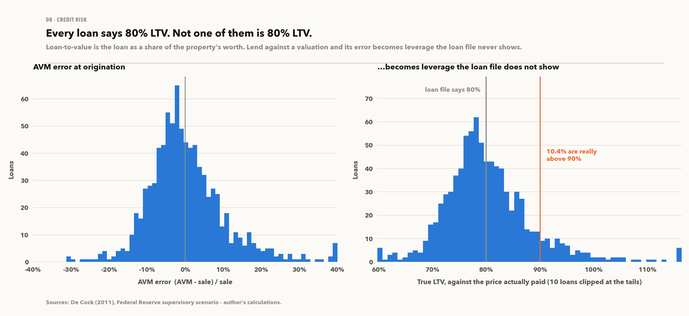

Loans are written at 80% LTV on the AVM value, as a lender would, not on the sale price.
Only out-of-sample AVM values are used, so the error is real.

Every loan file says 80%, but measured against the sale price no loan is at 80%. True LTV
spreads about ±15 points, and **10.4% of the book is actually above 90% LTV**. The spread is
all AVM error, and because losses rise faster than LTV, a book spread around 80% is riskier
than one where every loan really is at 80%.

| | Base | Severely adverse, imposed (−30%) | 10th-percentile metro, measured (−41%) |
|---|---:|---:|---:|
| Weighted MTM LTV | 80.1% | 114.5% | 136.8% |
| Negative equity | 2.7% | 93.9% | **99.5%** |
| Expected loss | **88 bps** | **1,183 bps** (13.4×) | **1,905 bps** (21.5×) |

The −30% figure is the supervisory severely adverse assumption, the number a committee
expects to see, but it isn't calibrated to anything. Notebook 02 checked it against 410 US
metros: **19% fell further** in 2005–2013, and the 10th-percentile market fell 41%. A
shock that one market in five has exceeded in recent memory is moderate, so both scenarios
are reported.

The stress is imposed because Ames's own history has no severe downturn to learn from. It
runs on a freshly originated book. The same houses, seasoned since 2009–2010, carry almost
no expected loss, because sixteen years of amortisation and price growth have built up
equity.

**Main result.** Every figure above values collateral at the AVM's point estimate, as if
the valuation were exact. Valuing it at the low end of the model's 80% range instead adds
**75 bps** to base expected loss (85% on an 88 bps base) and **250 bps** under stress. The
charge follows the width of the range being served. Switching from one width to per-band
widths left it about the same (65 / 218 bps before, 65 / 216 after), since wider cheap and
top bands offset narrower middle ones. Re-fitting on the latest sales raised it, because
the latest market is harder to value and the range is wider.

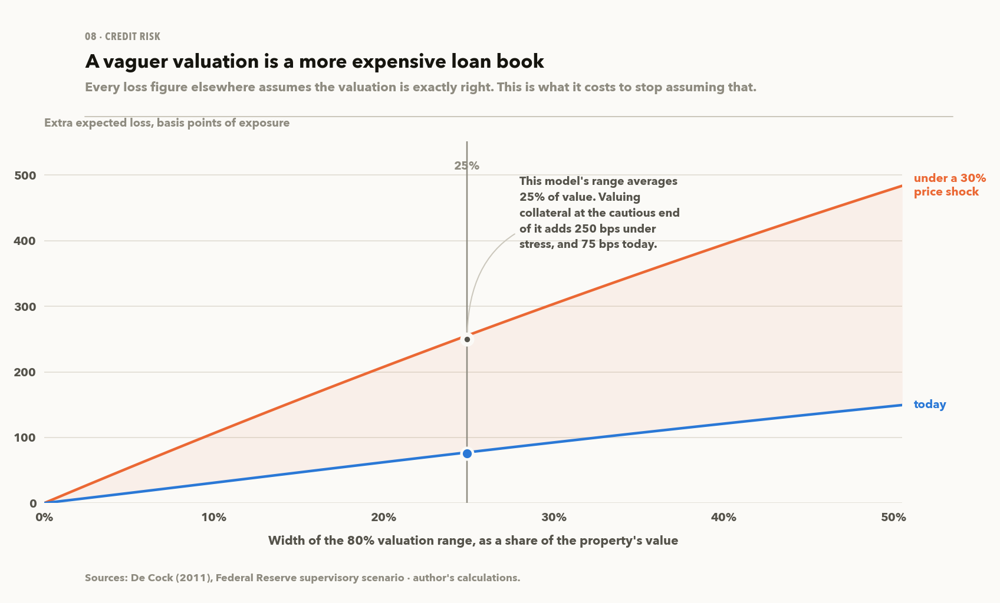

So AVM uncertainty is a credit-risk input, and improving the AVM in notebook 03 has a
value in basis points of expected loss, not just in accuracy metrics.

### 8 · Fair lending, on real loans ([`09_fair_lending.ipynb`](notebooks/09_fair_lending.ipynb))

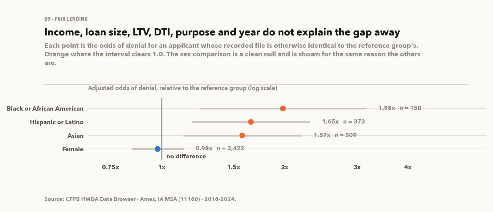

Notebook 04 tested the AVM for error parity across neighbourhoods and noted that it was
not a fair-lending test, because the Ames sales file has no protected-class attribute. HMDA
does record race, ethnicity and sex, for the same metro area, so the test runs on the
lending data instead: **32,926 applications from 2018–2024, 25,203 of them decided.**

Raw denial rates are **24.7% for Black applicants and 11.5% for white applicants**. The
Black group is only 174 applications, so the Wilson interval runs from 19% to 32%.
Adjusted for income, loan size, LTV, DTI, purpose, lien, occupancy and year, the odds of
denial are **1.98x (95% CI 1.24–3.16)** for Black applicants and **1.65x (1.19–2.30)** for
Hispanic or Latino applicants. Female against male applicants comes out at 0.98x, with no
gap, which is what the method should find where none is expected.

The main objection is that HMDA has no credit score, which predicts denial and correlates
with race. §4 answers it with an E-value: to explain the gap away, an unmeasured factor
would need a **3.37x** association with both being Black and being denied, on top of every
control already in the model (1.78x at the confidence limit). That lets a reader judge how
plausible the objection is. It bounds the unexplained disparity and is not a finding of
discrimination, which the notebook states where the number appears.

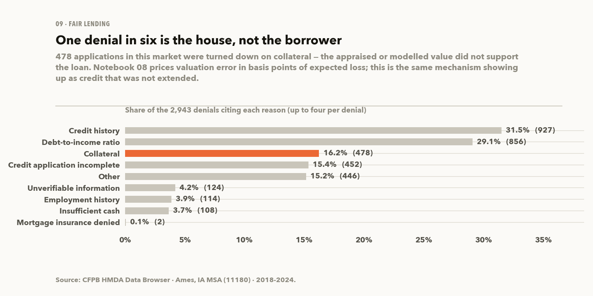

Two results feed back into the modelling. **16.2% of denials cite collateral**: 478 loans
where the valuation, not the borrower, stopped the deal. Notebook 08 prices valuation
error as lender loss; here it shows up as credit that was never extended.

And **only 11.9% of real loans are at exactly 80% LTV**; 18.5% are at or below 60% and
18.1% above 95%. Notebook 08 writes every loan at 80% to isolate the effect of AVM error,
which suits that question but limits how far the result generalises. The accurate
statement is that AVM uncertainty adds 85% to expected loss on a book built to isolate
it, and a real book starts with a fatter tail.

### 9 · The client deliverable ([`10_client_deliverable.ipynb`](notebooks/10_client_deliverable.ipynb))

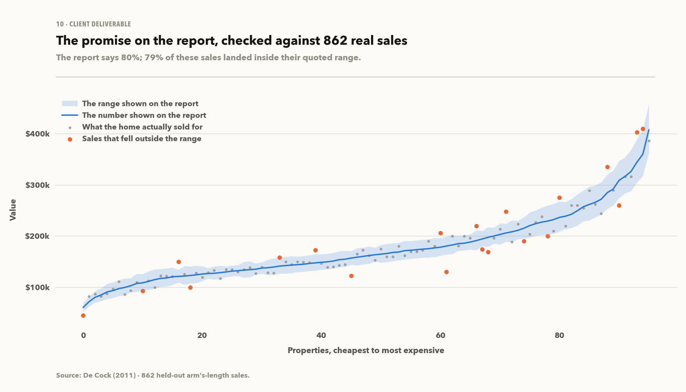

A self-contained one-page HTML valuation report with no JavaScript or network calls. It
works in light and dark mode and in print. Samples in [`reports/valuations/`](reports/valuations).

It combines the valuation (03), its range (04), the neighbourhood bias measured against it
(04), the screening score (06) and the monitoring status (05), so any disagreement between
them would show up here.

Most of the work was deciding what to leave out. MdAPE, SHAP values and Moran's I are all
available and none of them is on the page; the range tells the reader what they need.

One sample property was valued at $437,333 with a range of $389k–$491k and sold for
**$500,000**, outside the range, as about one sale in five should be. The report's
neighbourhood note, *this model under-values homes in NridgHt by 3.5%*, pointed the right
way. An earlier price-band note that also pointed the right way on this sale has been
withdrawn, because it was measured by sale price and triggered by valuation (Model Risk Log
defect #11).

The report states an 80% range. Checked against the range each held-out sale would have
been given at the time, 78.8% of sales land inside it (76.7% if the range is calibrated
only once). The report quotes the measured figure next to the 80%.

### 10 · Serving the model ([`src/ames/service.py`](src/ames/service.py))

The AVM is also served over HTTP.

```bash
make serve    # or: docker run --rm -p 7860:7860 ames-avm

curl -X POST http://localhost:7860/value \
  -H 'content-type: application/json' \
  -d '{"neighborhood":"NAmes","gr_liv_area":1456,"overall_qual":6,"year_built":1977}'
```
```json
{"value": 147820, "low": 133182, "high": 164067, "confidence": 0.8,
 "measured_coverage": 0.788, "interval_band": 3, "fields_supplied": 5,
 "fields_imputed": 74, "flags": [...], "disclaimer": "Not for lending, underwriting or any real..."}
```

Five design decisions are visible in that response:

- **Ten fields in.** The model uses 101 columns, a caller knows about ten, and only three
  are required. Anything omitted is treated as unknown and filled from the neighbourhood's
  median or mode, never as zero. Derived features such as quality × area are then
  recomputed from the completed row by the training code. `fields_imputed` tells the
  caller how much was filled in.
- **`measured_coverage` is in the payload.** The range is nominally 80%; backtested out of
  time with quarterly re-fitting, it covers 78.8%, and every response says so.
- **The width depends on the valuation.** `interval_band` says which of the five bands set
  it. The model card lists each band's range, width and backtested coverage, and the
  window the bands were last fitted on. The band is chosen from the valuation, since the
  caller has no sale price.
- **Temporal figures are quoted.** The random-split numbers look better but don't describe
  how the model is used, which is forward in time.
- **An unknown neighbourhood returns a `422`** with the list of valid ones, not a
  city-wide guess.

`GET /properties/{pid}/report` renders the same one-page report as notebook 10, from the
same function. `GET /model-card` serves accuracy, coverage, monitoring status and known
weaknesses from the deployed artifacts, so it always describes the model that is running.

Deployment is a separate step. Notebooks write to the gitignored `data/processed/`, and the
container reads `serving/artifacts/`, a committed snapshot made by `make promote`. The
deployed model is therefore a specific commit, separate from whatever was last trained.
Details in [`serving/README.md`](serving/README.md).

The API isn't hosted publicly because Hugging Face moved Docker Spaces to a paid tier. The
public page is a [static results page](https://huggingface.co/spaces/myesmin1103/ames-avm)
built by `make site` from the same summary files the notebooks write. The service runs
locally or on any container host.

---

## Model Risk Log

Ten defects in the first-pass notebooks, found by reading them line by line before
building anything on top. The full write-up, with code excerpts and fixes, is in
[`docs/MODEL_RISK_LOG.md`](docs/MODEL_RISK_LOG.md).

| # | Defect | Location | Impact | Structural fix |
|---|---|---|---|---|
| 1 | `kaggle_test[f] = ames_train[f]`: train values written into the test frame | nb 2, cell 27 | Test set silently replaced by row-aligned train data. Every test number meaningless. | One `ColumnTransformer`; no cross-frame assignment exists |
| 2 | A second `StandardScaler` `fit` on `kaggle_test` | nb 3, cell 29 | Submissions standardised to the test set's own moments, not the train moments | Exactly one scaler, inside the pipeline |
| 3 | `lasso.fit(X, y)` on the full dataset before the split | nb 3, cell 31 | `alpha` selected using held-out rows | All tuning inside `GridSearchCV` on training rows |
| 4 | `pd.get_dummies` run separately per frame, columns back-filled | nb 3, cells 16–23 | Test-only levels dropped; `drop_first` can drop different baselines | `OneHotEncoder(handle_unknown="infrequent_if_exist")` |
| 5 | EDA concluded `log(SalePrice)`; models fit on raw dollars | nb 1 c11 vs nb 3 c27 | Heteroskedastic residuals; RMSE dominated by expensive homes | `log` target + Duan smearing |
| 6 | `test_size=0.05`, 103 rows | nb 3, cell 27 | Test RMSE too noisy to select a model with | 25% / the full 2009–10 period |
| 7 | Random split across 2006–2010 | nb 3, cell 27 | Trains on the future to predict the past | Both regimes reported side by side |
| 8 | Outlier and `Garage Yr Blt = 2207` fixes commented out | nb 2, cells 12 & 15 | A garage built in 2207 stayed in the training data | `clean_known_errors`, asserted in tests |
| 9 | Five columns dropped for high nullity | nb 2, cell 26 | `NA` means *"feature absent"*. Fireplaces (51% of homes) sell +43%; fences −18% | Explicit `absent` level on 15 columns |
| 10 | `np.log1p` applied in place mid-notebook | nb 1, cells 28–32 | Notebook not re-runnable; one cell references an undefined name | Pure functions; `make run` from a clean kernel |

Defects 1–4 are covered by 13 regression tests in `tests/test_leakage.py`. The main one
checks that the fitted transformer's statistics are bit-identical with and without the
test rows, and a second test checks that the first one can fail.

Two more defects came from the rebuild itself and were caught later by its own checks.
They are logged the same way:

| # | Defect | Location | Impact | Structural fix |
|---|---|---|---|---|
| 11 | Price-band bias measured by sale price, applied to a valuation | `report.py`; nb 03, 04 | Client reports advised shading cheap valuations down ~10% for a bias that is ~2–3% conditional on the valuation, and absent at the top | Flag withdrawn; bias re-measured by valuation; regression test in `tests/test_report.py` |
| 12 | The API imputed derived features (quality × area, total sq ft, age) instead of computing them from the caller's fields | `service.py` | Valuations barely moved with size or quality: $132k vs $143k for a 900 vs 2,600 sq ft house in one neighbourhood | Derive after imputation with the training code; omitted fields imputed, not zeroed; tests in `tests/test_service.py` |

---

## Data

2,930 properties × 82 columns, plus twelve external series. Full provenance, verified
extents and licences: [`docs/DATA_SOURCES.md`](docs/DATA_SOURCES.md).

| Source | What it adds | Verified |
|---|---|---|
| De Cock (2011), *J. Statistics Education* 19(3) | All 2,930 rows with `SalePrice`, including the 878 withheld labels | 2,930 × 82 |
| `ames_geo.rda` (Kuhn's `AmesHousing` R package) | Property lat/long | 99.59% join on `PID` |
| FHFA HPI, Ames MSA and Story County (FRED) | The price path each sale rolls forward on | 1986-Q4 →, 1978 → |
| Case-Shiller national (FRED) | The benchmark Ames is measured against | 1987 → |
| Freddie Mac PMMS 30-yr (FRED) | Contemporaneous mortgage rates | weekly, 1971 → |
| CPI-U, 10-yr Treasury (FRED) | Real price path, discounting | 1947 →, 1962 → |
| Story County income, Iowa median HH income, Ames unemployment (FRED) | Affordability | 1969 →, 1984 →, 1990 → |
| Zillow ZHVI / ZORI, Ames MSA | 2026 values and rents | 210 / 107 monthly obs |
| Story County Auditor + Iowa LSA | Levy 30.58245/$1,000 × rollback 47.4316% = 1.4505% | committed, cited, tested |
| HMDA (CFPB Data Browser), Ames MSA | Real mortgage applications: outcomes, denial reasons, LTV, and race / ethnicity / sex | 32,926 filings, 2018–2024 |
| FHFA metro panel, all US metros | Places Ames in a distribution instead of against an average; calibrates the stress scenario | 410 metros, quarterly from 1975 |

Census ACS and HUD FMR are left out because both need an API key, and `make data` has to
work on a clean clone with no secrets. Tax and vacancy assumptions come from cited Story
County and City of Ames sources instead.

Compared with the pre-split CSVs, the full extract adds two things:
- The 878 "test" rows get their true `SalePrice` back, so the holdout can be scored.
- Sales run from 2006 to 2010 (625 / 694 / 622 / 648 / 341 by year), which allows a
  temporal split.

---

## Reproducing

```bash
git clone <this repo> && cd real-estate-valuation-risk
make all          # setup -> data -> test -> run
```

| Target | What it does |
|---|---|
| `make setup` | `uv venv` (Python 3.12) + `requirements.txt`, not the anaconda base env |
| `make data` | Downloads every external source; asserts 2,930 rows, ≥99% geo join, all 12 series non-empty |
| `make test` | 304 tests: finance functions against closed-form results, conformal coverage, leakage regressions, drift metrics, screening metrics, data contracts, API contracts |
| `make run` | Executes all ten notebooks end-to-end from a clean kernel; fails the build on any error |
| `make map` | Regenerates the notebook dependency diagram at the top of this file |
| `make promote` | Snapshots the trained model into `serving/artifacts/` |
| `make site` | Builds the static results page into `site/` from the summary JSONs |
| `make serve` | Runs the valuation API locally on `:7860` (`/docs` in a browser) |
| `make image` | Builds the serving container |

`data/raw/` and `data/external/` are gitignored and rebuilt from the sources in
`docs/DATA_SOURCES.md`. Only the first-pass modelling split (which exists nowhere public)
and the cited tax table are committed.

### Layout

```
src/ames/          data · features · avm · finance · risk · monitoring · screening
                   fairlending · metro · warehouse · report · service · viz
                   config · compat
sql/               the DuckDB feature layer (comparable sales)
notebooks/         01 EDA · 02 macro+geo · 03 AVM · 04 governance · 05 monitoring
                   06 screening · 07 underwriting · 08 credit risk · 09 fair lending
                   10 client deliverable
tests/             test_data · test_finance · test_avm · test_leakage · test_warehouse
                   test_monitoring · test_screening · test_report · test_service
                   test_fairlending · test_metro
docs/              GLOSSARY · MODEL_VALIDATION_REPORT · MODEL_RISK_LOG
                   METHODOLOGY · ASSUMPTIONS · DATA_SOURCES
serving/           artifacts/ (the promoted model the container reads)
tools/             promote_model · build_site · flow_map
reports/           figures/ · valuations/ (sample client reports)
site/              build output of `make site` (gitignored; published as the Space)
archive/           the first-pass notebooks, kept unedited as the risk log's evidence
```

CI runs the tests on every push. A scheduled weekly job downloads all twelve external
sources and re-checks the shapes and date ranges quoted in `DATA_SOURCES.md`, so a source
that revises its history gets noticed. A third job builds the container and values a
property through it.

The finance functions are checked against independent references (`numpy_financial`, the
annuity formula written out by hand, and algebraic identities). Conformal coverage is
tested at three α levels, including a heteroskedastic case built to break the Gaussian
interval.

---

## Limitations

Each of these limits a conclusion above.

1. **Ames is nearly acyclical.** 4.3% peak-to-trough, with **82% of 410 US metros falling
   further**. Every degradation measured under the temporal split is a **lower bound**, and
   the credit stress has to be imposed because the local history has no downturn.
   Notebook 02 measures how mild the market was, which also showed the −30% scenario to be
   a moderate one.
2. **No repeat sales.** Every property appears once, so the residual-based mispricing view is
   a screen, not a backtest; there are no realised returns to check it against.
3. **Rents are not contemporaneous with sales.** ZORI starts October 2017; sales end July
   2010. Notebook 07 underwrites these properties at today's values; it is not a
   historical backtest. The rent-scaling model (size elasticity, bedroom premium) is
   judgement and is the largest single source of error in every NOI.
4. **The fair-lending result is a bound, not a verdict.** HMDA records no credit score,
   no assets and no employment history. The adjusted disparities in notebook 09 are an
   upper bound on unexplained disparity, and the E-value says how strong the missing
   variable would have to be. Public data can't go further. Disparate treatment
   is a legal finding requiring evidence of conduct, and nothing here is that. The Black
   applicant group is 174 applications over seven years, and the interval says so.
5. **The PD curve is a shape, not an estimate.** There are no default outcomes in the Ames
   data. The curve follows the usual empirical shape but isn't calibrated, so the
   basis-point figures are indicative, not quotable.
6. **28 neighborhoods × 5 years is four growth observations.** The concentration analysis says
   so at the point of use. A correlation from four points has a standard error near 0.5.
7. **MdAPE misses the 5% bar.** ~1,200 training transactions in one small city against a
   production AVM's millions of records with assessment, listing and permit feeds.
8. **Self-assessed.** The Model Risk Log and the validation report were written by the
   person who built the model. SR 11-7 requires independent validation, which this isn't;
   the validation report says so in §7.1.
9. **The monitoring period was quiet.** Six quarters in a market that barely moved. The
   controls fire on a population they should reject, but they have never faced a real
   change in the market.
10. **The screen's operating point rests on a judged cost ratio.** 10:1 is argued for, not
   measured. Moving it to 3:1 or 30:1 materially changes what gets flagged.

## Planned work, in priority order

1. **A calibrated PD curve** from public loan-performance data (Freddie Mac's single-family
   loan-level dataset, free with registration), so the basis-point figures in notebook 08
   can be quoted, not just read as indicative. Every credit number here currently rests on
   an uncalibrated curve (Limitation 5).
2. **Spatial structure, not spatial level.** A spatial lag feature (prior nearby sale
   prices) was built and measured: it cut Moran's I by 18% and improved no accuracy metric
   (notebook 03 §9), so the model already knew what nearby houses cost. The remaining candidates encode structure rather than level: school
   attendance boundaries, arterial frontage, parcel-level adjacency. School-district
   geometry ships with the same package as the property geocodes.
3. **A second metro with property-level data**, plus public county assessor records back
   to the 1990s, so the concentration analysis becomes a measurement instead of an
   illustration. Ames has no real cycle to validate against; the metro panel says what a
   cyclical market looks like, but only property-level data from a second market would let
   the AVM be tested through one.
4. **An independent validation** by someone who didn't build the model, as SR 11-7
   expects.

---

## Reading order

- **Five minutes:** the [Overview](#overview), then one of the sample reports in
  [`reports/valuations/`](reports/valuations).
- **Engineering:** [`docs/MODEL_RISK_LOG.md`](docs/MODEL_RISK_LOG.md) for what was wrong and
  how it was fixed, then `tests/test_leakage.py`.
- **Modelling:** [`03_hedonic_avm.ipynb`](notebooks/03_hedonic_avm.ipynb), then
  [`04_uncertainty_and_governance.ipynb`](notebooks/04_uncertainty_and_governance.ipynb).
- **Model risk and regulated lending:**
  [`docs/MODEL_VALIDATION_REPORT.md`](docs/MODEL_VALIDATION_REPORT.md), in the structure
  SR 11-7 expects, with severity-rated findings.
- **Fair lending:** [`09_fair_lending.ipynb`](notebooks/09_fair_lending.ipynb) §3 and §4.
- **The main result:**
  [`08_credit_risk_and_portfolio.ipynb`](notebooks/08_credit_risk_and_portfolio.ipynb) §5.
- **Terminology:** [`docs/GLOSSARY.md`](docs/GLOSSARY.md), which assumes no background in
  finance, statistics or machine learning.

[`docs/METHODOLOGY.md`](docs/METHODOLOGY.md) explains why each method was chosen and what
would falsify the choice.
